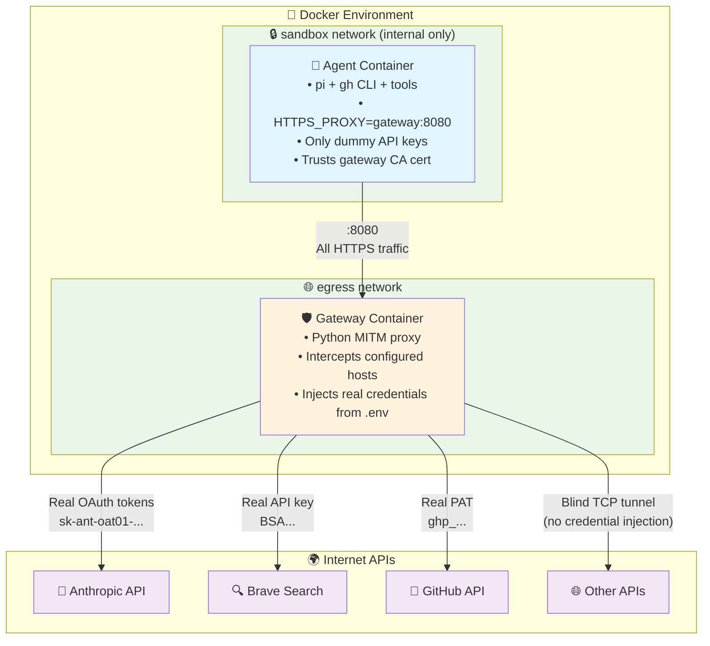

# Truman Proxy

**Secure, sandboxed [pi](https://github.com/badlogic/pi-mono) agent with credential injection.**

Run pi inside a Docker container with zero-trust security:
- 🔒 **Agent never sees real API keys** — gateway injects credentials transparently
- 🌐 **Network isolation** — agent cannot access internet directly, only through MITM proxy
- 🔄 **Auto-refreshing tokens** — OAuth tokens refresh automatically, no manual rotation
- 📁 **Host filesystem access** — work on your projects with full pi capabilities

## Quick Start

**Prerequisites:** Docker Desktop + [pi](https://github.com/badlogic/pi-mono) installed on host

```bash
# 1. Log in to Anthropic via pi on host (if not already)
pi    # then type /login → select Anthropic

# 2. Sync your OAuth refresh token
make sync-token

# 3. Add optional keys (Brave, GitHub) to .env
# Edit .env — see .env.example for options

# 4. Build and run
make run
```

## Architecture



### How It Works

1. **Agent** sends all HTTPS requests with dummy API keys through `HTTPS_PROXY` to the gateway
2. **Gateway** intercepts HTTPS traffic for configured hosts (Anthropic, Brave, GitHub) and performs MITM
3. Gateway strips dummy credentials and injects real ones from `.env` before forwarding
4. For non-configured hosts, gateway performs blind TCP tunneling (no credential injection)
5. Agent runs on internal-only network with no direct internet access — all traffic must go through gateway
6. Gateway automatically refreshes OAuth tokens proactively and reactively on 401 responses

### Credential Flow

| Service        | Agent sees              | Gateway injects                              |
|----------------|-------------------------|----------------------------------------------|
| Anthropic API  | `sk-ant-oat01-DUMMY...` | Auto-refreshed OAuth token (from `.env`)     |
| Brave Search   | `BSAdummy...`           | Real `BRAVE_API_KEY`                         |
| GitHub API/git | `ghp_DUMMY...`          | Real `GH_TOKEN`                              |

The gateway holds a long-lived **refresh token** for Anthropic and automatically obtains short-lived access tokens. Tokens are refreshed proactively before expiry and reactively on 401 responses — no manual token rotation needed.

## Make Targets

| Target               | Description                             |
|----------------------|-----------------------------------------|
| `make help`          | Show all available targets              |
| `make build`         | Build all container images              |
| `make run`           | Interactive CLI/TUI session             |
| `make prompt p="…"`  | Single prompt                           |
| `make rpc`           | RPC mode (JSONL on stdin/stdout)        |
| `make shell`         | Bash shell in agent (for debugging)     |
| `make shell-gateway` | Bash shell in gateway (for debugging)   |
| `make logs`          | Stream gateway logs                     |
| `make sync-token`    | Sync Anthropic OAuth token from host pi |
| `make clean`         | Remove containers, volumes, and images  |

## API Keys

**Security model:** Agent only sees dummy credentials, gateway holds real ones.

| File         | Contains                  | Read by           | Git status           |
|--------------|---------------------------|-------------------|----------------------|
| `.env`       | Real API keys             | Gateway container | **gitignored**       |
| `.env.agent` | Dummy keys + proxy config | Agent container   | **committed** (safe) |

### Required in `.env`

```bash
# Recommended: OAuth refresh token (auto-refreshes, never expires)
ANTHROPIC_REFRESH_TOKEN=sk-ant-ort01-...

# Alternatives (pick one):
# ANTHROPIC_OAUTH_TOKEN=sk-ant-oat01-...   # Static OAuth token (expires in hours)
# ANTHROPIC_API_KEY=sk-ant-api03-...        # API key (requires paid API plan)
```

Use `make sync-token` to extract the refresh token from your host pi installation automatically.

### Optional in `.env`

```bash
BRAVE_API_KEY=BSAp-...
GH_TOKEN=ghp_...   # GitHub PAT for gh CLI and git operations
```

## Adding New Services

To add credential injection for a new API:

1. Add hostname + header rules to `INTERCEPT_RULES` in `gateway/gateway.py`
2. Add real credential to `.env`
3. Add dummy value to `.env.agent`

Done — any tool using that API gets automatic credential injection.

## Skills & Prompts

**Skills** from `~/.pi/agent/skills/` and **prompts** from `~/.pi/agent/prompts/` are baked into the image at build time. Run `make build` to pick up changes.

- **Included skills:** brave-search, gccli, gdcli, gmcli, transcribe, youtube-transcript, polymarket
- **Excluded skills:** browser-tools, vscode (require host resources)

## Sessions

Sessions persist in Docker volume `pi-data` and survive container restarts. To wipe: `make clean`

## Design Documents

- [Full plan](docs/plan.md)
- [Phase 1: Docker container](docs/plan-phase-1.md)
- [Phase 2: Secret gateway + network isolation](docs/plan-phase-2.md)
